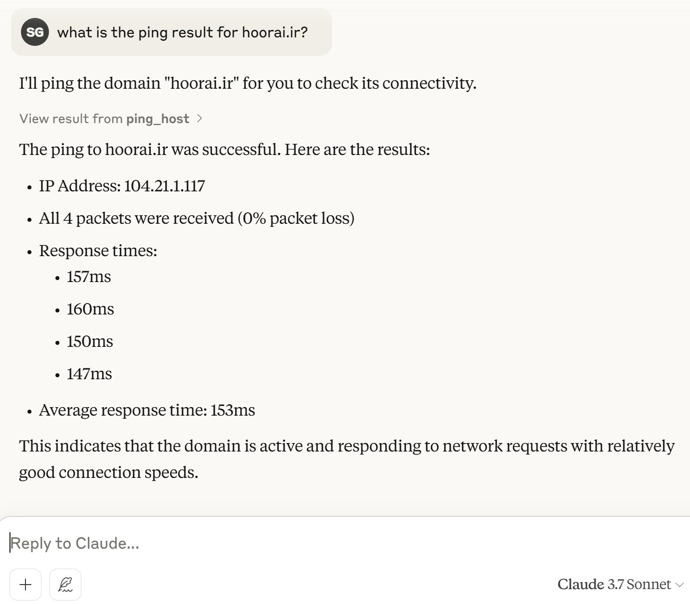

# MCP Ping Server

A server implementation that provides ping functionality to Claude Desktop through MCP (Model Context Protocol). This server allows Claude to perform network connectivity tests and ping operations.

## Features

- `ping_host`: Ping any host with customizable packet count
- `check_connectivity`: Quick internet connectivity check using Google's DNS (8.8.8.8)
- Cross-platform support (Windows, Linux, MacOS)
- Asynchronous operation using FastMCP and Starlette
- Server-Sent Events (SSE) for real-time communication

## Requirements

- Python 3.12+
- Dependencies (automatically installed through pip):
  - httpx
  - mcp[cli]
  - uvicorn
  - starlette

## Installation

1. Clone the repository
2. Install dependencies using pip:

```bash
pip install .
```

## Usage

### Starting the Server

Run the server using Python:

```bash
python main.py [--host HOST] [--port PORT]
```

Default settings:

- Host: 0.0.0.0 (accessible from any network interface)
- Port: 8080

### Claude Desktop Configuration

To use this server with Claude Desktop, add the following configuration to your Claude Desktop's configuration file (claude_desktop_config.json):

```json
{
  "mcpServers": {
    "ping": {
      "command": "npx",
      "args": [
        "mcp-remote",
        "http://localhost:8080/sse"
      ]
    }
  }
}
```

Sample test with Claude desktop :



### Available Tools

1. `ping_host`
   - Purpose: Ping a specified host
   - Parameters:
     - `host`: Hostname or IP address to ping
     - `count`: Number of ping packets (1-20, default: 4)

2. `check_connectivity`
   - Purpose: Check internet connectivity
   - Parameters:
     - `host`: Target host (default: 8.8.8.8)

## Security Note

The server is designed for local use with Claude Desktop. Be cautious when exposing it to public networks.

## License

This project is open-source. Feel free to modify and distribute as needed.
